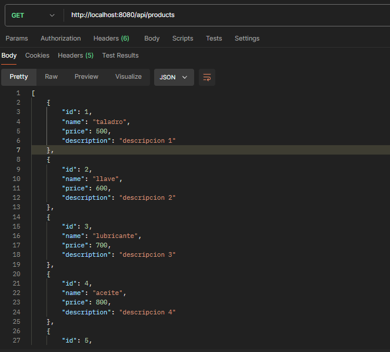
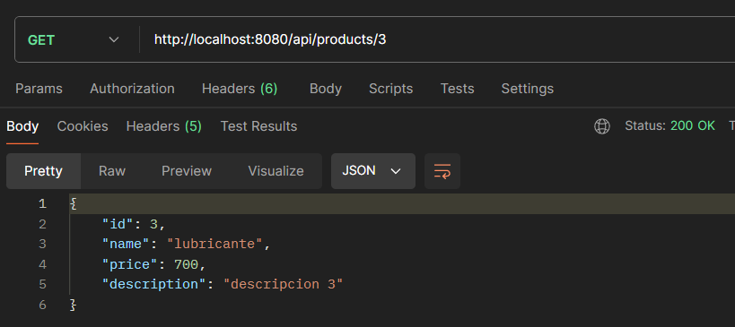
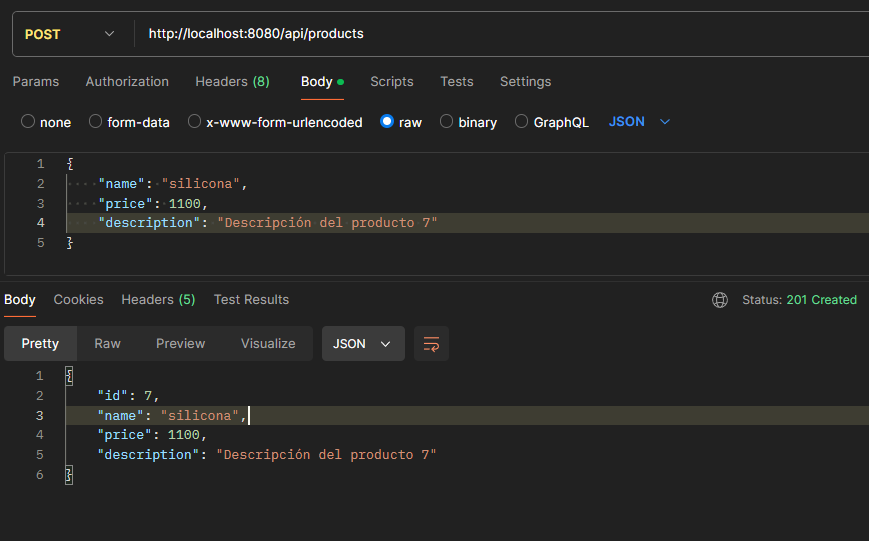
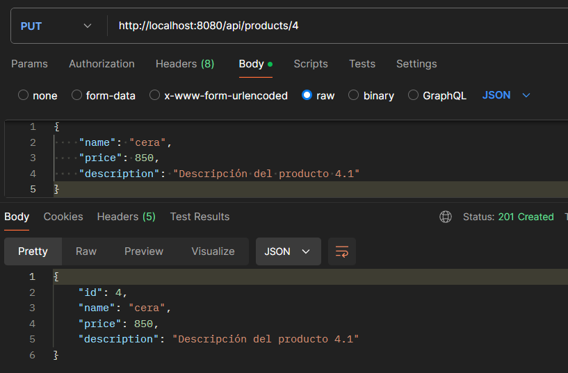
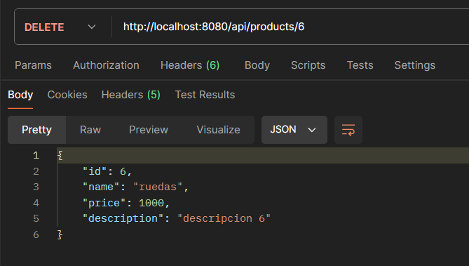
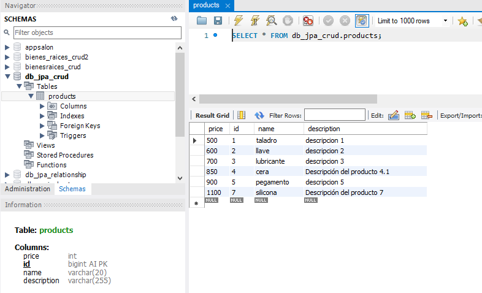

# Api RESTful - CRUD Spring Data JPA
## Descripción del proyecto
Este proyecto es un ejemplo de una API RESTful CRUD (Crear, Leer, Actualizar, Eliminar) utilizando Spring Boot 3. La API permite realizar operaciones CRUD en una entidad `Product` y maneja mensajes de error con Java Bean Validation y un archivo de propiedades personalizado llamado `messages.properties`. También se incluye cómo utilizar Postman para probar los endpoints.

## Configuracion del Proyecto
### Dependencias
El proyecto esta creado con las siguientes dependencias.
| Plugin                | Descripcion      																		|
|-----------------------|---------------------------------------------------------------------------------------|
| Spring Web 			| Para construir aplicaciones web y RESTful.											|
| Spring Boot DevTools  | Para mejorar la experiencia de desarrollo con herramientas de reinicio automático.	|
| MySQL JDBC Driver     | Para conectar con una base de datos MySQL.											|
| Spring Data JPA       | Para facilitar la interacción con bases de datos utilizando JPA.						|
| Validation I/O        | Para la validación de datos en las entidades.											|
## Configuracion de Base de Datos
Configuramos la conexión a la base de datos MySQL:
```
spring.application.name=springboot-jpa
spring.datasource.url=jdbc:mysql://localhost:3306/db_jpa_crud
spring.datasource.username=your_username
spring.datasource.password=your_password
spring.datasource.driver-class-name=com.mysql.cj.jdbc.Driver
spring.jpa.database-platform=org.hibernate.dialect.MySQLDialect
spring.jpa.show-sql=true
spring.jpa.hibernate.ddl-auto=create
```
## Archivo de importacion de Datos ( `import.sql` )
Creamos un archivo `messages.properties`en `src/main/resources` para personalizar los mensajes de error:
```sql
INSERT INTO products (name, price, description) VALUES ('taladro', 500, 'descripcion 1');
INSERT INTO products (name, price, description) VALUES ('llave', 600, 'descripcion 2');
INSERT INTO products (name, price, description) VALUES ('lubricante', 700, 'descripcion 3');
INSERT INTO products (name, price, description) VALUES ('aceite', 800, 'descripcion 4');
INSERT INTO products (name, price, description) VALUES ('pegamento', 900, 'descripcion 5');
INSERT INTO products (name, price, description) VALUES ('ruedas', 1000, 'descripcion 6');
```
## Archivo de propiedades personalizado ( `messages.properties` )
Creamos un archivo `messages.properties`en `src/main/resources` para personalizar los mensajes de error:
```css
NotEmpty.product.name=es requerido!
Size.product.name=debe ser mayor de 3 caracteres por favor!

NotNull.product.price=es requerido por favor!
Min.product.price=debe ser un valor numerico mayor o igual a 500!

NotBlank.product.description=es requerida, no puede estar vacia! 
```
## Implementacion
### Entidad `Product`
Creamos la clase `Product` en el paquete `com.franco.curso.springboot.app.springboot_crud.entities`:
```java
@Entity
@Table(name = "products")
public class Product {

    @Id
    @GeneratedValue(strategy = GenerationType.IDENTITY)
    private Long id;

    @NotEmpty(message = "{NotEmpty.product.name}") //para string
    @Size(min = 3, max = 20, message = "{Size.product.name}")
    private String name;

    @Min(value = 500, message = "{Min.product.price}")
    @NotNull(message = "{NotNull.product.price}")//objetos y demas
    private Integer price;

    
    @NotBlank(message = "{NotBlank.product.description}")
    private String description;

    public Long getId() {
        return id;
    }

    public void setId(Long id) {
        this.id = id;
    }

    public String getName() {
        return name;
    }

    public void setName(String name) {
        this.name = name;
    }

    public Integer getPrice() {
        return price;
    }

    public void setPrice(Integer price) {
        this.price = price;
    }

    public String getDescription() {
        return description;
    }

    public void setDescription(String description) {
        this.description = description;
    }
}
```
### Repositorio `PersonRepository`
Creamos la interfaz `PersonRepository` en el paquete `com.franco.curso.springboot.app.springboot_crud.repositories`:
```java
//DAO
// consultas personalizadas 
// para poder ver, crear, listar, eliminar, ver por id
package com.franco.curso.springboot.app.springboot_crud.repositories;

import org.springframework.data.repository.CrudRepository;

import com.franco.curso.springboot.app.springboot_crud.entities.Product;

public interface ProductRepository extends CrudRepository<Product, Long>{
}

```
### Service
1. Creamos la interfaz `PersonServiceImpl` en el paquete `com.franco.curso.springboot.app.springboot_crud.services` que herada de `PersonService`:
```java
@Service
public class ProductServiceImpl implements ProductService {

    @Autowired
    private ProductRepository repository;

    @Transactional(readOnly = true)
    @Override
    public List<Product> findAll() {
        return (List<Product>) repository.findAll();
    }

    @Override
    @Transactional(readOnly = true)
    public Optional<Product> findById(Long id) {
        return repository.findById(id);
    }

    @Override
    @Transactional
    public Product save(Product product) {
        return repository.save(product);
    }

    @Override
    @Transactional
    public Optional<Product> update(Long id, Product product) {
        Optional<Product> productOptional = repository.findById(id);
        if (productOptional.isPresent()) {
            Product productDb = productOptional.orElseThrow();
            
            productDb.setName(product.getName());
            productDb.setDescription(product.getDescription());
            productDb.setPrice(product.getPrice());
            return Optional.of(repository.save(productDb));
            
        }
        return productOptional;
    }

    @Transactional
    @Override
    public Optional<Product> delete(Long id) {
        Optional<Product> productOptional = repository.findById(id);
        productOptional.ifPresent(productDb -> {
            repository.delete(productDb);
        });
        return productOptional;
    }
}
```
2. Clase `ProductService`
```java
package com.franco.curso.springboot.app.springboot_crud.services;

import java.util.List;
import java.util.Optional;

import com.franco.curso.springboot.app.springboot_crud.entities.Product;

public interface ProductService {

    List<Product> findAll();

    Optional<Product> findById(Long id);

    Optional<Product> update(Long id, Product product);

    Product save(Product product);
    
    Optional<Product> delete(Long id);
} 
```

### Controlador
```java
@RestController
@RequestMapping("/api/products")
public class ProductController {
    
    @Autowired
    private ProductService service;

    @GetMapping
    public List<Product> list() {
        return service.findAll();
    }
    
    @GetMapping("/{id}")
    public ResponseEntity<?> view(@PathVariable Long id) {
        Optional<Product> productOptional = service.findById(id);
        if (productOptional.isPresent()) {
            return ResponseEntity.ok(productOptional.orElseThrow());
        }
        return ResponseEntity.notFound().build();//404
    }
    
    @PostMapping
    public ResponseEntity<?> create(@Valid @RequestBody Product product, BindingResult result) {
        if (result.hasFieldErrors()) {
            return validation(result);
        }
        // Product productNew = service.save(product); 
        return ResponseEntity.status(HttpStatus.CREATED).body(service.save(product));
    }

    private ResponseEntity<?> validation(BindingResult result) {
        // llave y valor. llave: name, description y price. value: mensaje de error de la validacion
        Map<String, String> errors = new HashMap<>();

        result.getFieldErrors().forEach(err -> {
            errors.put(err.getField(), "El campo " + err.getField() + " "+ err.getDefaultMessage());
        });
        
        return ResponseEntity.badRequest().body(errors);
    }

    @PutMapping("/{id}") 
    public ResponseEntity<?> update( @Valid @RequestBody Product product, BindingResult result, @PathVariable Long id ) {
        
        if (result.hasFieldErrors()) {
            return validation(result);
        }

        Optional<Product> productOptional = service.update(id, product);
        if (productOptional.isPresent()) {
            return ResponseEntity.status(HttpStatus.CREATED).body(productOptional.orElseThrow());
        }
        return ResponseEntity.notFound().build();
    }

    @DeleteMapping("/{id}")
    public ResponseEntity<?> delete(@PathVariable Long id) {
        Optional<Product> productOptional = service.delete(id);
        if (productOptional.isPresent()) {
            return ResponseEntity.ok(productOptional.orElseThrow());
        }
        return ResponseEntity.notFound().build();
    }
}
```
## Mostrando mensajes de error
Puedes usar Postman para probar los diferentes endpoints de la API. A continuación se presentan los detalles de los endpoints disponibles:
### 1. Obtener todos los productos
* Metodo HTTP: **GET**
* URL: `http://localhost:8080/api/products`
* Descripción: Obtiene una lista de todos los productos.
* 
### 2. Obtener un producto por ID
* Metodo HTTP: **GET**
* URL: `http://localhost:8080/api/products/{id}`
* Descripción: Obtiene un producto por su **id**.
* Parámetros: 
    * `id` (Long): ID del producto
* 
### 3. Crear un nuevo producto
* Metodo HTTP: **POST**
* URL: `http://localhost:8080/api/products`
* Descripción: Crea un nuevo producto.
* Cuerpo de la solicitud(**JSON**): 
```json
{
    "name": "silicona",
    "price": 1100,
    "description": "Descripción del producto 7"
}
```
* 
### Actualizar un producto por ID
* Metodo HTTP: **PUT**
* URL: `http://localhost:8080/api/products/{id}`
* Descripción: Actualiza un producto existente por su **id**.
* Parámetros: 
    * `id` (Long): ID del producto
* Cuerpo de la solicitud(**JSON**): 
```json
{
    "name": "cera",
    "price": 850,
    "description": "Descripción del producto 4.1"
}
```
* 
### Eliminar un producto por ID
* Metodo HTTP: **DELETE**
* URL: `http://localhost:8080/api/products/{id}`
* Descripción: Elimina un producto existente por su **id**.
* Parámetros: 
    * `id` (Long): ID del producto
* 

**Mostramos como quedo la tabla en Mysql Workbench**
* 